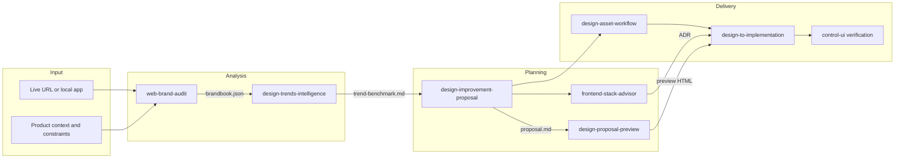
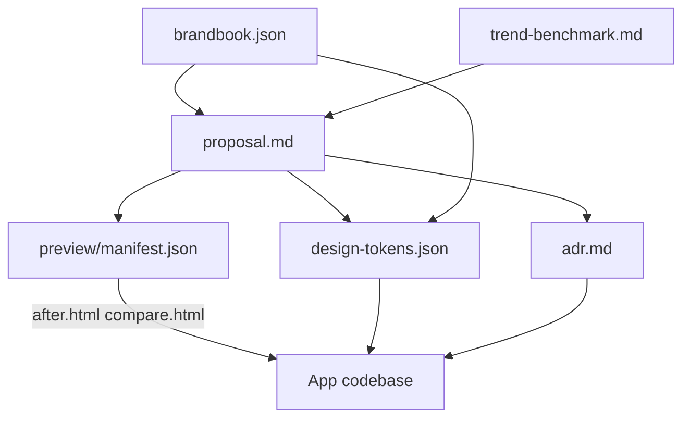
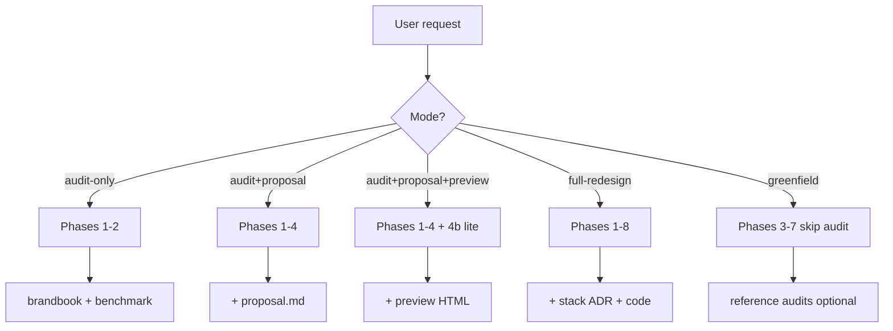
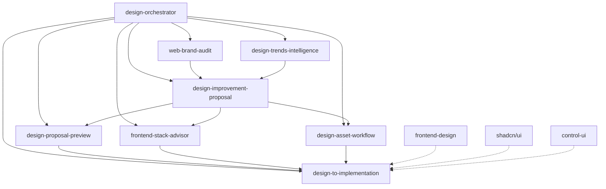
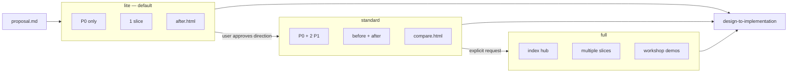

# Design Intelligence Skills

Modular [Cursor Agent Skills](https://docs.cursor.com/agent/skills) for end-to-end **design intelligence**: audit live sites, extract brandbooks, benchmark trends, propose improvements, preview changes in HTML/CSS, recommend frontend stacks, and implement in code.

Inspired by [Anthropic frontend-design](https://github.com/anthropics/claude-code/tree/main/plugins/frontend-design), [shadcn/ui skills](https://ui.shadcn.com/docs/skills), and [basement.studio](https://basement.studio/) craft patterns.

---

## Architecture overview

The suite is a **pipeline of 8 skills** orchestrated by `design-orchestrator`. Each skill owns one phase, produces structured artifacts, and hands off to the next.



### Artifact flow

Structured files connect phases so the agent (and your team) can review, diff, and approve before writing production code.



### Orchestrator modes

Pick a mode to control scope, cost, and time. The orchestrator skips phases that do not apply.



**Gates:** no implementation without user approval; preview defaults to **lite** tier to save agent time and tokens.

---

## Skills included

| Skill | Phase | Output |
|-------|-------|--------|
| [`design-orchestrator`](design-orchestrator/SKILL.md) | Router | Pipeline checklist, mode selection |
| [`web-brand-audit`](web-brand-audit/SKILL.md) | 2 | `brandbook.json` |
| [`design-trends-intelligence`](design-trends-intelligence/SKILL.md) | 3 | `trend-benchmark.md` |
| [`design-improvement-proposal`](design-improvement-proposal/SKILL.md) | 4 | `proposal.md` |
| [`design-proposal-preview`](design-proposal-preview/SKILL.md) | 4b | `preview/*.html`, `manifest.json` |
| [`frontend-stack-advisor`](frontend-stack-advisor/SKILL.md) | 5 | ADR / stack doc |
| [`design-asset-workflow`](design-asset-workflow/SKILL.md) | 6 | tokens, Figma, Canvas |
| [`design-to-implementation`](design-to-implementation/SKILL.md) | 7 | code changes |

### Skill dependency graph



External skills (dashed) are recommended companions, not bundled in this repo.

---

## Preview architecture (cost-aware)

HTML previews are **static slices**, not full app rebuilds. Three tiers balance fidelity vs agent cost.



| Tier | Scope | Files | Best for |
|------|-------|-------|----------|
| **lite** | P0, 1 slice | `after.html`, `tokens.css` | Fast validation |
| **standard** | P0 + 2 P1 | `before.html`, `after.html`, `compare.html` | Stakeholder review |
| **full** | Hub + slices | `index.html`, `slices/*` | Workshops |

Non-visual recommendations (perf, backend, device tiers) are marked `skip` in `manifest.json`.

---

## Installation

### Personal (all projects)

Skills in `~/.cursor/skills/` are discovered automatically in **any** Cursor workspace — open your product repo, not this repo, to use them day-to-day.

```bash
# Option A — Skills CLI (recommended)
npx skills add francopetruu/design-intelligence-skills

# Option B — Clone into Cursor skills directory
git clone https://github.com/francopetruu/design-intelligence-skills.git ~/.cursor/skills/design-intelligence-skills
```

Windows (PowerShell):

```powershell
git clone https://github.com/francopetruu/design-intelligence-skills.git $env:USERPROFILE\.cursor\skills\design-intelligence-skills
```

### Per-project

```bash
npx skills add francopetruu/design-intelligence-skills --path .cursor/skills
```

---

## Quick start

In Cursor Agent, with your **product folder** open:

```
Using design-orchestrator, audit https://example.com, propose improvements, and generate a lite HTML preview.
```

Step by step:

1. `web-brand-audit` → `brandbook.json`
2. `design-trends-intelligence` → `trend-benchmark.md`
3. `design-improvement-proposal` → `proposal.md`
4. `design-proposal-preview` → `preview/after.html` or `compare.html`
5. `frontend-stack-advisor` → ADR (if building or migrating)
6. `design-asset-workflow` → tokens or Figma
7. `design-to-implementation` → code changes

Recommended output folder in your project:

```
your-app/
└── design-intelligence/
    └── example-com/
        ├── brandbook.json
        ├── trend-benchmark.md
        ├── proposal.md
        ├── design-tokens.json
        └── preview/
            ├── manifest.json
            ├── after.html
            └── compare.html
```

---

## Scripts

```bash
# Validate brandbook JSON against schema
node scripts/validate-brandbook.js path/to/brandbook.json

# Extract CSS variables from a URL (optional; requires Playwright)
npm install -D playwright
npx playwright install chromium
node scripts/extract-tokens.js https://example.com
```

---

## Complementary skills

```bash
npx skills add shadcn/ui
```

Also useful: Anthropic `frontend-design`, `vercel-react-best-practices`, `control-ui`, `canvas`, `using-ui-stack` ([awesome-cursor-skills](https://github.com/spencerpauly/awesome-cursor-skills#frontend--ui)).

Optional: [Figma Cursor Plugin](https://cursor.com/marketplace/figma) for design handoff in `design-asset-workflow`.

---

## Examples

Full walkthrough: [`examples/basement-studio-smoke/`](examples/basement-studio-smoke/)

| Artifact | Description |
|----------|-------------|
| `brandbook.json` | Validated brand extraction |
| `trend-benchmark.md` | Market + basement.studio trends |
| `proposal.md` | Scored recommendations P0–P2 |
| `preview/compare.html` | Before/after in browser |
| `preview/manifest.json` | Preview scope and skip reasons |
| `prototype/before.html` / `after.html` | P0 slice demo |

Open the compare view locally:

```bash
# from repo root
start examples/basement-studio-smoke/preview/compare.html   # Windows
open examples/basement-studio-smoke/preview/compare.html    # macOS
```

Templates: [`examples/saas-landing-template/`](examples/saas-landing-template/) · [`examples/greenfield-marketing/`](examples/greenfield-marketing/)

---

## Repository layout

```
design-intelligence-skills/
├── design-orchestrator/
├── web-brand-audit/
├── design-trends-intelligence/
├── design-improvement-proposal/
├── design-proposal-preview/
├── frontend-stack-advisor/
├── design-to-implementation/
├── design-asset-workflow/
├── scripts/                    # validate-brandbook, extract-tokens
├── examples/
└── .cursor-plugin/             # optional Cursor plugin packaging
```

---

## License

Skill content: MIT. Anthropic frontend-design patterns referenced under Apache 2.0 where applicable.

## Maintenance

Update trend references in `design-trends-intelligence/references/` quarterly. Each file includes a `Last reviewed` date.
